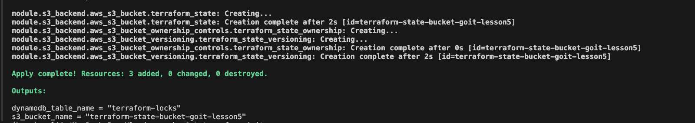
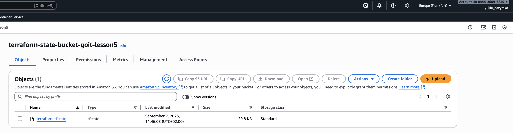
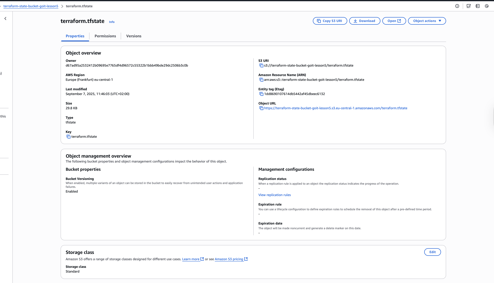
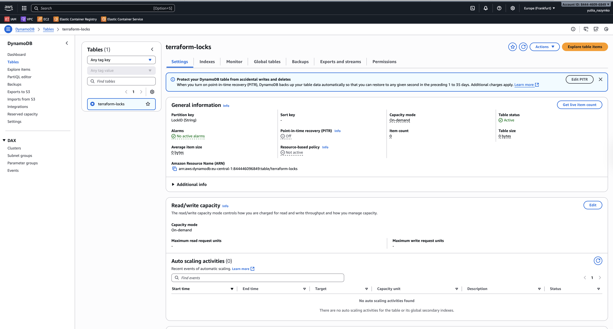
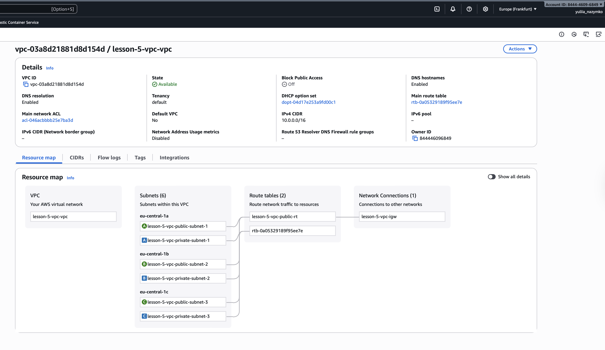
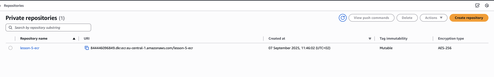

# Домашнє завдання до теми «IaC (Terraform)»

Цей проєкт створює інфраструктуру на AWS за допомогою **Terraform**.  
Він включає налаштування бекенду для стейтів, мережеву інфраструктуру (VPC) та
репозиторій для Docker-образів (ECR).

## Структура проєкту

```
├── .gitignore
├── .prettierrc
├── README.md
├── assets/
│   ├── screen_01.png
│   ├── screen_02.png
│   ├── screen_03.png
│   ├── screen_04.png
│   ├── screen_05.png
│   ├── screen_06.png
│   └── screen_07.png
├── backend.tf               # Налаштування віддаленого бекенду (S3 + DynamoDB)
├── main.tf                  # Головний файл для підключення модулів
├── outputs.tf               # Загальні вихідні дані по інфраструктурі
├── modules/
│   ├── ecr/                 # Модуль для створення ECR репозиторію
│   │   ├── ecr.tf
│   │   ├── outputs.tf
│   │   └── variables.tf
│   ├── s3-backend/          # Модуль для створення S3 бакету і DynamoDB таблиці
│   │   ├── dynamodb.tf
│   │   ├── outputs.tf
│   │   ├── s3.tf
│   │   └── variables.tf
│   └── vpc/                 # Модуль для побудови мережевої інфраструктури (VPC)
│       ├── outputs.tf
│       ├── routes.tf
│       ├── variables.tf
│       └── vpc.tf
```

```bash
# Ініціалізація Terraform (завантаження провайдерів і модулів)
terraform init

# Перегляд планованих змін інфраструктури
terraform plan

# Застосування конфігурації
terraform apply

# Видалення інфраструктури
terraform destroy

```

---

## Модулі

### S3

- Створює **S3 bucket** для стейтів.
- Увімкнене версіювання.
- Створює **DynamoDB таблицю** для блокування.

 
 

---

### VPC

- Створює **VPC** з CIDR блоком.
- Додає **3 публічні** та **3 приватні підмережі**.
- Налаштовує **Internet Gateway** і **NAT Gateway**.
- Маршрутизація через Route Tables.



---

### ECR

- Створює **ECR-репозиторій**.
- Включає **scan on push** для перевірки безпеки образів.
- Налаштовує політику доступу.


