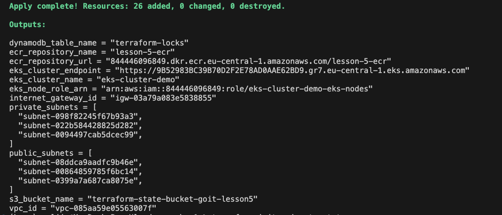
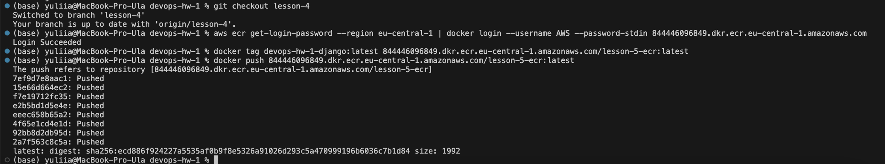
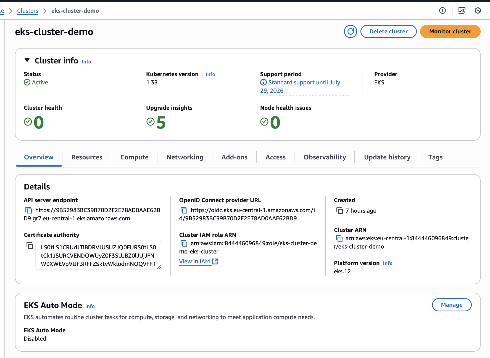
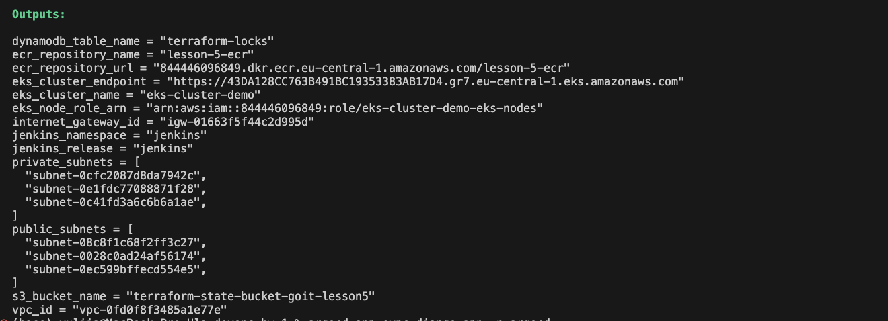
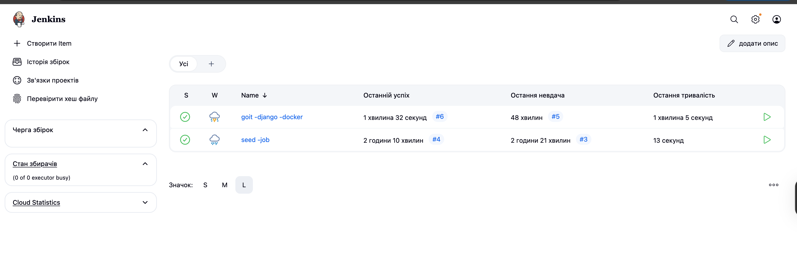
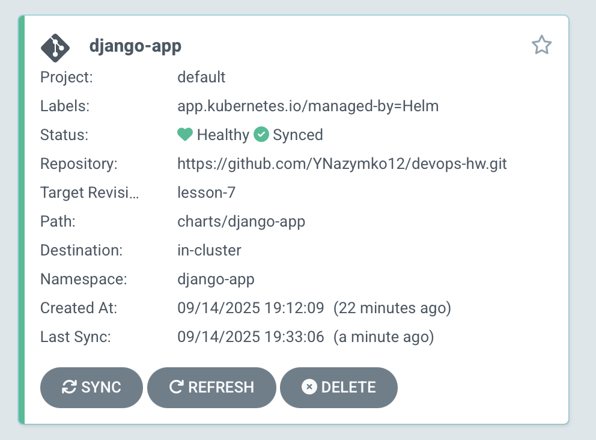
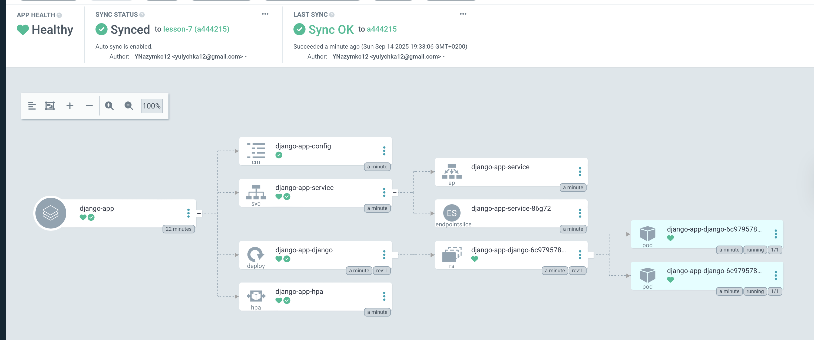

# Домашнє завдання до теми «Вивчення Agro CD + CD»

## Terraform

Інструкції для застосування Terraform:

```bash
# Ініціалізація Terraform
terraform init

# Перевірка плану змін
terraform plan

# Застосування змін (підтвердження "yes")
terraform apply


## Результат

 
 

```

## Jenkins

Як перевірити Jenkins job:

1. Відкрий Jenkins UI у браузері: http://<JENKINS_SERVER>:8080
2. Вибери потрібну job (наприклад, build-django-app)
3. Натисни "Build Now"
4. Переглянь "Console Output" для результатів виконання

## Argo CD

Як побачити результат у Argo CD:

1. Проброс порту для доступу до UI Argo CD: kubectl port-forward
   svc/argo-cd-argocd-server -n argocd 8080:443

2. Відкрий у браузері: https://localhost:8080

3. Логін:

   - Користувач: admin
   - Пароль: kubectl -n argocd get secret argocd-initial-admin-secret -o
     jsonpath="{.data.password}" | base64 -d

4. Перевірка статусу додатків: kubectl get applications.argoproj.io -n argocd

5. Перегляд подів Argo CD: kubectl get pods -n argocd

6. Перегляд сервісів Argo CD: kubectl get svc -n argocd

7. Для синхронізації додатку у UI Argo CD натисни "Sync"

## Результати

 
 

