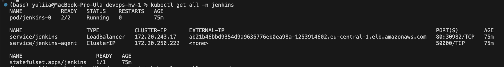
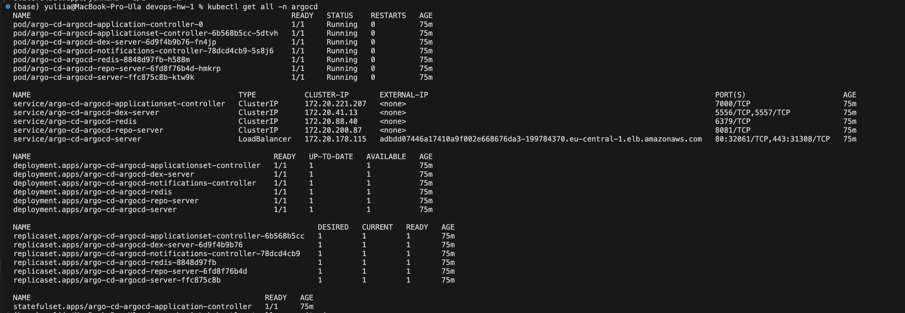
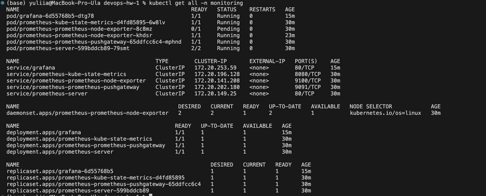
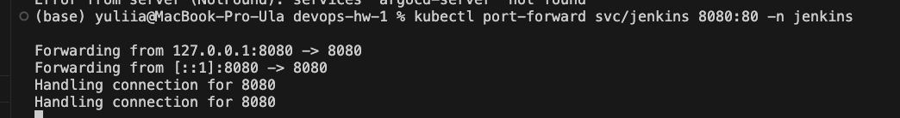
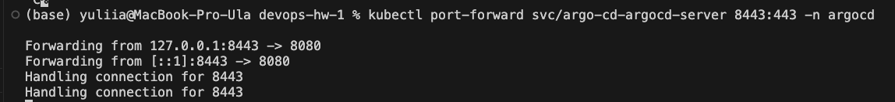
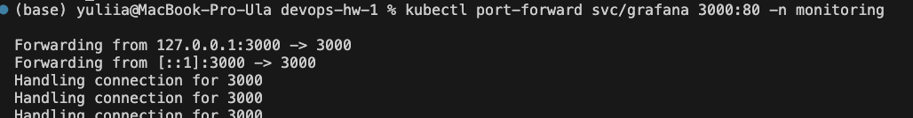
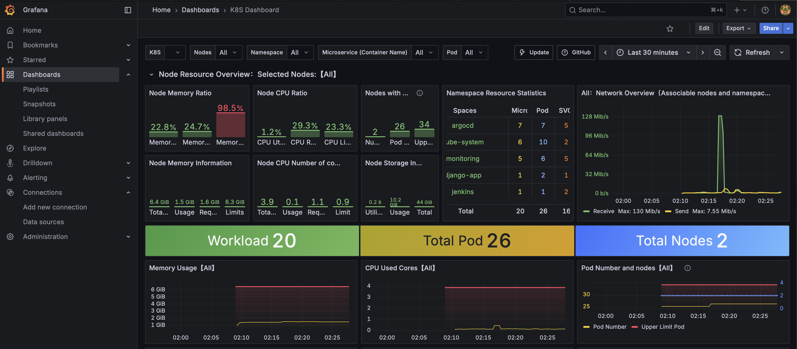
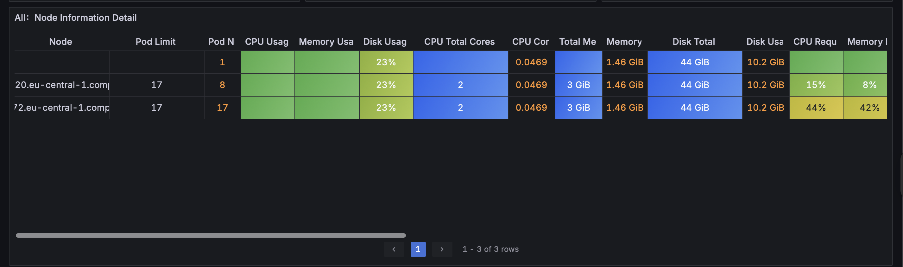
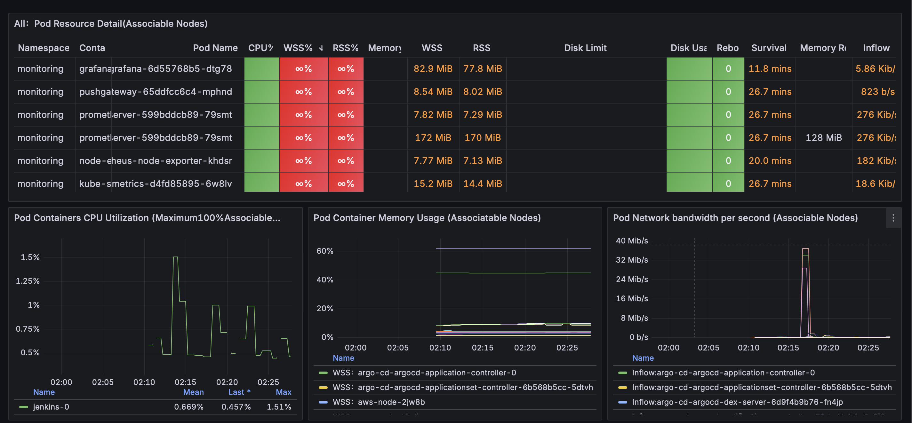
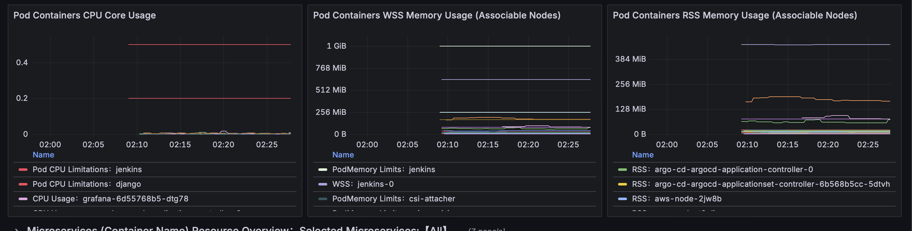

# Фінальний проєкт: Розгортання інфраструктури AWS з використанням Terraform

## Опис проєкту

Цей проєкт демонструє повне розгортання cloud-native інфраструктури на AWS з
використанням Infrastructure as Code (IaC) підходу через Terraform. Проєкт
включає налаштування повного CI/CD pipeline, моніторингу та управління
Kubernetes кластером.

## Архітектура проєкту

### Основні компоненти

- **S3 Backend** - S3 бакет та DynamoDB для зберігання Terraform state
- **VPC** - Virtual Private Cloud для ізоляції мережі з підмережами та Internet
  Gateway
- **EKS** - Elastic Kubernetes Service для оркестрації контейнерів з AWS EBS CSI
  Driver
- **RDS** - Relational Database Service з підтримкою Aurora кластера
- **ECR** - Elastic Container Registry для зберігання Docker образів
- **Jenkins** - CI/CD автоматизація через Helm chart
- **Argo CD** - GitOps інструмент для CD з кастомними applications та
  repositories
- **Django Application** - Веб-додаток з Helm chart для деплою

### Технічний стек

- **Інфраструктура**: AWS Cloud (S3, DynamoDB, VPC, EKS, RDS Aurora, ECR)
- **IaC**: Terraform з модульною архітектурою
- **Оркестрація**: Kubernetes (EKS) з AWS EBS CSI Driver
- **CI/CD**: Jenkins (Helm) + Argo CD (GitOps)
- **Контейнеризація**: Docker + ECR
- **Додаток**: Django з Helm chart для деплою
- **State Management**: S3 + DynamoDB для Terraform backend

## Terraform

Інструкції для застосування Terraform:

```bash
# Ініціалізація Terraform
terraform init

# Перевірка плану змін
terraform plan

# Застосування змін (підтвердження "yes")
terraform apply

# Видалення всіх створених ресурсів
terraform destroy

```

### Перевірка розгорнутих сервісів

#### Jenkins

1. **Перевірка статусу подів**

   ```bash
   kubectl get all -n jenkins
   ```

2. **Доступ до Jenkins UI**

   ```bash
   kubectl port-forward svc/jenkins 8080:8080 -n jenkins
   ```

   Відкрийте браузер та перейдіть на: `http://localhost:8080`

3. **Отримання початкового пароля**
   ```bash
   kubectl exec -n jenkins deployment/jenkins -- cat /var/jenkins_home/secrets/initialAdminPassword
   ```

#### Argo CD

1. **Перевірка статусу подів**

   ```bash
   kubectl get all -n argocd
   ```

2. **Доступ до Argo CD UI**

   ```bash
   kubectl port-forward svc/argocd-server 8081:443 -n argocd
   ```

   Відкрийте браузер та перейдіть на: `https://localhost:8081`

3. **Отримання початкового пароля**

   ```bash
   kubectl -n argocd get secret argocd-initial-admin-secret -o jsonpath="{.data.password}" | base64 -d
   ```

   Логін: `admin`

4. **Перевірка Argo CD Applications**

   ```bash
   # Список додатків
   kubectl get applications -n argocd

   # Детальна інформація про додаток
   kubectl describe application <app-name> -n argocd
   ```

#### Django Application

1. **Перевірка деплою Django додатку**

   ```bash
   kubectl get all -n default -l app=django-app
   ```

2. **Доступ до Django додатку**

   ```bash
   kubectl port-forward svc/django-app 8000:80 -n default
   ```

   Відкрийте браузер та перейдіть на: `http://localhost:8000`

3. **Перевірка логів Django**
   ```bash
   kubectl logs -f deployment/django-app -n default
   ```

#### ECR Repository

1. **Перевірка створених репозиторіїв**

   ```bash
   aws ecr describe-repositories
   ```

2. **Аутентифікація в ECR**
   ```bash
   aws ecr get-login-password --region <region> | docker login --username AWS --password-stdin <account-id>.dkr.ecr.<region>.amazonaws.com
   ```

#### Prometheus та Grafana

**Встановлення Prometheus та Grafana**

```bash
# Додайте Helm репозиторій
helm repo add prometheus-community https://prometheus-community.github.io/helm-charts
helm repo add grafana https://grafana.github.io/helm-charts
helm repo update

# Встановлення Prometheus
helm install prometheus prometheus-community/kube-prometheus-stack -n monitoring --create-namespace

# Доступ до Grafana
kubectl port-forward svc/prometheus-grafana 3000:80 -n monitoring
```

3. **Dashboard ID 15661 для Grafana**

   Після встановлення Grafana:

   - Перейдіть до `http://localhost:3000`
   - Логін/пароль: `admin/prom-operator`
   - Import Dashboard → Введіть ID: `15661`
   - Це dashboard надає детальні метрики для Kubernetes кластера

## Висновки

Цей проєкт демонструє:

- Успішне розгортання повної cloud-native інфраструктури на AWS з використанням
  модульної архітектури Terraform
- Налаштування CI/CD pipeline з Jenkins (Helm) та Argo CD для GitOps workflow
- Розгортання Django додатку через Helm charts з автоматичним управлінням через
  Argo CD
- Використання AWS managed services (EKS, RDS Aurora, ECR, S3, DynamoDB)
- Infrastructure as Code підхід з централізованим state management
- Масштабованість через AWS EBS CSI Driver та HPA для додатків

## Результати

  
  
  

