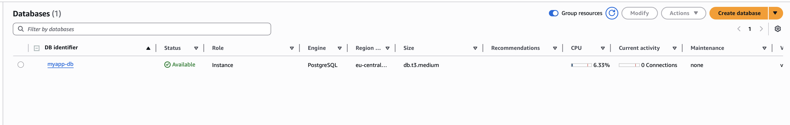
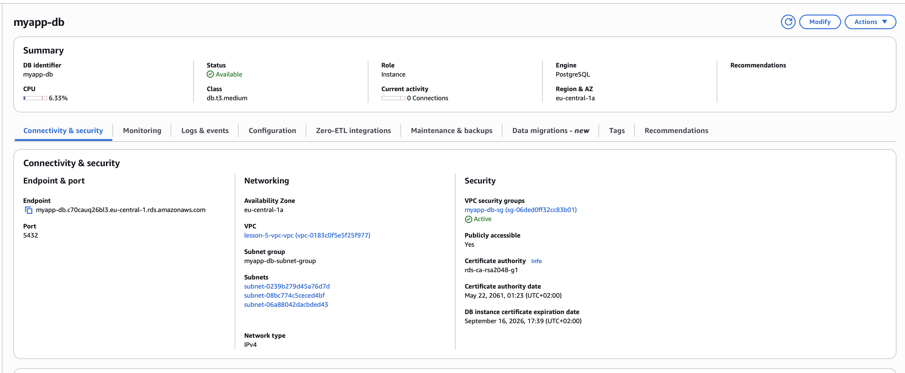
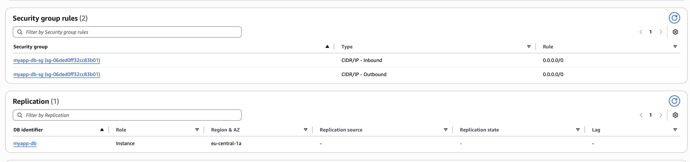
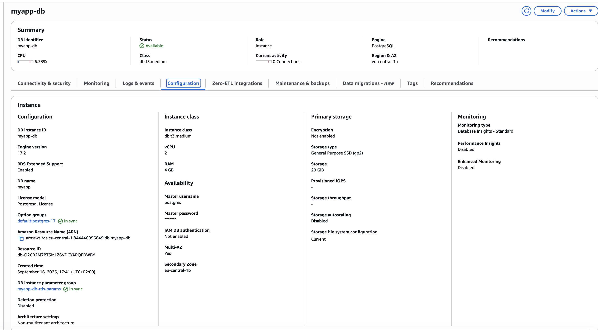
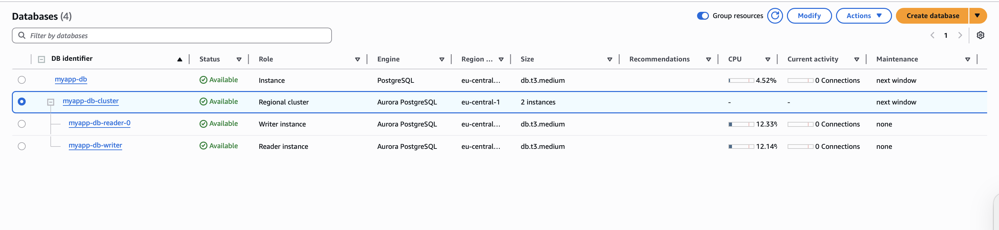

# Домашнє завдання до теми «Створення гнучкого Terraform-модуля для баз даних»

Універсальний Terraform модуль для розгортання AWS RDS Database. Підтримує як
стандартні RDS інстанси, так і Aurora Clusters з мінімальними змінами в
конфігурації.

## Особливості модуля

- **Універсальність**: Один модуль для RDS та Aurora
- **Автоматичне створення**: DB Subnet Group, Security Group, Parameter Groups
- **Гнучкість**: Підтримка різних типів БД, версій та класів інстансів
- **Багаторазове використання**: Мінімальні зміни для різних середовищ

## Terraform

Інструкції для застосування Terraform:

```bash
# Ініціалізація Terraform
terraform init

# Перевірка плану змін
terraform plan

# Застосування змін (підтвердження "yes")
terraform apply

```

## Архітектура

### При `use_aurora = false` (Standard RDS):

- Створюється одна `aws_db_instance`
- Створюється `aws_db_parameter_group` для стандартного RDS
- Підтримується Multi-AZ

### При `use_aurora = true` (Aurora Cluster):

- Створюється `aws_rds_cluster`
- Створюється один Writer інстанс
- Створюється задана кількість Reader реплік
- Створюється `aws_rds_cluster_parameter_group`

## Приклади використання

### 1. Стандартний PostgreSQL RDS

```hcl
module "postgres_rds" {
  source = "./modules/rds"

  name                       = "myapp-postgres"
  use_aurora                 = false

  # RDS-specific параметри
  engine                     = "postgres"
  engine_version             = "17.2"
  parameter_group_family_rds = "postgres17"

  # Загальні параметри
  instance_class             = "db.t3.medium"
  allocated_storage          = 100
  db_name                    = "myapp"
  username                   = "postgres"
  password                   = "SecurePassword123!"

  # Мережеві параметри
  subnet_private_ids         = ["subnet-12345", "subnet-67890"]
  subnet_public_ids          = ["subnet-abcde", "subnet-fghij"]
  publicly_accessible        = false
  vpc_id                     = "vpc-123456789"

  # Опції
  multi_az                   = true
  backup_retention_period    = 7

  # Параметри БД
  parameters = {
    max_connections              = "200"
    log_min_duration_statement   = "500"
    shared_preload_libraries     = "pg_stat_statements"
  }

  tags = {
    Environment = "production"
    Project     = "myapp"
  }
}
```

### 2. Aurora PostgreSQL Cluster

```hcl
module "aurora_postgres" {
  source = "./modules/rds"

  name                       = "myapp-aurora"
  use_aurora                 = true
  aurora_replica_count       = 2

  # Aurora-specific параметри
  engine_cluster             = "aurora-postgresql"
  engine_version_cluster     = "15.3"
  parameter_group_family_aurora = "aurora-postgresql15"

  # Загальні параметри
  instance_class             = "db.r6g.large"
  db_name                    = "myapp"
  username                   = "postgres"
  password                   = "SecurePassword123!"

  # Мережеві параметри
  subnet_private_ids         = module.vpc.private_subnets
  vpc_id                     = module.vpc.vpc_id
  publicly_accessible        = false

  # Опції
  backup_retention_period    = 14

  # Параметри БД
  parameters = {
    log_statement              = "all"
    log_min_duration_statement = "1000"
    max_connections            = "500"
  }

  tags = {
    Environment = "production"
    Project     = "myapp"
    Type        = "aurora"
  }
}
```

## Змінні модуля

### Обов'язкові змінні

| Змінна               | Тип            | Опис                                     |
| -------------------- | -------------- | ---------------------------------------- |
| `name`               | `string`       | Унікальна назва для БД інстансу/кластера |
| `db_name`            | `string`       | Назва бази даних для створення           |
| `username`           | `string`       | Master користувач БД                     |
| `password`           | `string`       | Пароль для master користувача            |
| `vpc_id`             | `string`       | ID VPC де створюватиметься БД            |
| `subnet_private_ids` | `list(string)` | Список ID приватних підмереж             |

### Опціональні змінні

#### Загальні параметри

| Змінна                    | Тип           | За замовчуванням | Опис                                            |
| ------------------------- | ------------- | ---------------- | ----------------------------------------------- |
| `use_aurora`              | `bool`        | `false`          | Використовувати Aurora замість стандартного RDS |
| `instance_class`          | `string`      | `"db.t3.micro"`  | Клас інстансу БД                                |
| `publicly_accessible`     | `bool`        | `false`          | Доступність БД з інтернету                      |
| `db_port`                 | `number`      | `5432`           | Порт для підключення до БД                      |
| `backup_retention_period` | `string`      | `""`             | Період зберігання резервних копій (днів)        |
| `tags`                    | `map(string)` | `{}`             | Теги для всіх ресурсів                          |

#### Параметри для стандартного RDS

| Змінна                       | Тип      | За замовчуванням | Опис                           |
| ---------------------------- | -------- | ---------------- | ------------------------------ |
| `engine`                     | `string` | `"postgres"`     | Тип БД движка                  |
| `engine_version`             | `string` | `"14.7"`         | Версія движка БД               |
| `parameter_group_family_rds` | `string` | `"postgres15"`   | Сім'я parameter group для RDS  |
| `allocated_storage`          | `number` | `20`             | Обсяг сховища в GB             |
| `multi_az`                   | `bool`   | `false`          | Увімкнути Multi-AZ розгортання |

#### Параметри для Aurora

| Змінна                          | Тип      | За замовчуванням        | Опис                                            |
| ------------------------------- | -------- | ----------------------- | ----------------------------------------------- |
| `engine_cluster`                | `string` | `"aurora-postgresql"`   | Тип движка для Aurora кластера                  |
| `engine_version_cluster`        | `string` | `"15.3"`                | Версія движка для Aurora                        |
| `parameter_group_family_aurora` | `string` | `"aurora-postgresql15"` | Сім'я parameter group для Aurora                |
| `aurora_replica_count`          | `number` | `1`                     | Кількість read реплік в Aurora кластері         |
| `aurora_instance_count`         | `number` | `2`                     | Загальна кількість інстансів (writer + readers) |

#### Мережеві параметри

| Змінна              | Тип            | За замовчуванням | Опис                                    |
| ------------------- | -------------- | ---------------- | --------------------------------------- |
| `subnet_public_ids` | `list(string)` | `[]`             | Список ID публічних підмереж            |
| `parameters`        | `map(string)`  | `{}`             | Додаткові параметри для parameter group |

## Налаштування типів БД

### PostgreSQL

```hcl
# Стандартний RDS
engine                     = "postgres"
engine_version             = "17.2"  # або 16.4, 15.8, 14.13
parameter_group_family_rds = "postgres17"  # postgres16, postgres15, postgres14

# Aurora
engine_cluster             = "aurora-postgresql"
engine_version_cluster     = "15.3"
parameter_group_family_aurora = "aurora-postgresql15"
```

## Результати

 
 

